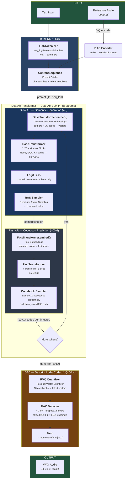

# Fish Speech — Inference Pipeline

## Pipeline Summary

| Stage | Model / Class | Purpose | Input | Output | Params |
|-------|--------------|---------|-------|--------|--------|
| **Tokenize** | `FishTokenizer` | Text to token IDs | Text string | Token IDs | — |
| **Prompt** | `ContentSequence` | Build chat-formatted prompt | Tokens + ref codes | `(11, seq_len)` tensor | — |
| **Embed** | `BaseTransformer.embed()` | Fuse text + codebook embeddings | Token IDs + VQ codes | Embedding vectors | — |
| **Slow AR** | `BaseTransformer` (32 blocks) | Generate semantic tokens (time axis) | Embeddings | 1 semantic token/step | 4B |
| **Fast AR** | `FastTransformer` (4 blocks) | Generate codebook codes (codebook axis) | Semantic token | 10 codebook codes/step | 400M |
| **VQ Decode** | `RVQ Quantizer` | Codebook lookup to latent space | `(10, n_tokens)` codes | `(latent_dim, n_tokens)` | — |
| **Audio Decode** | `DAC Decoder` | Upsample latents to waveform (512x) | Latent vectors | Raw audio samples | ~100M |
| **Ref Encode** | `DAC Encoder` | Reference audio to codebook tokens | Audio waveform | `(10, n_tokens)` codes | ~100M |

## Key: 10+1 Codebooks

Each timestep (~21.5 Hz) the Dual-AR generates **11 values**:

| Row | Generated by | Model | Meaning |
|-----|-------------|-------|---------|
| 0 | Slow AR | `BaseTransformer` | Semantic token (language, content, prosody) |
| 1-10 | Fast AR | `FastTransformer` | Acoustic codebooks (timbre, detail, phase) |

The Slow AR runs autoregressively along the **time axis** (token by token).
The Fast AR runs autoregressively along the **codebook axis** (10 codes per token, sequential).
