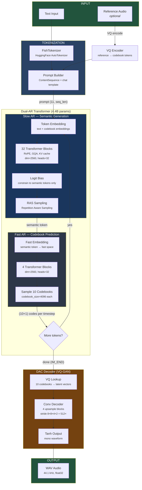

# Fish Speech — Inference Pipeline

## Pipeline Summary

| Stage | Component | Input | Output | Params |
|-------|-----------|-------|--------|--------|
| **Tokenize** | FishTokenizer | Text string | Token IDs | — |
| **Prompt** | ContentSequence | Tokens + ref codes | `(11, seq_len)` tensor | — |
| **Slow AR** | 32 transformer blocks | Embeddings | 1 semantic token/step | 4B |
| **Fast AR** | 4 transformer blocks | Semantic token | 10 codebook codes/step | 400M |
| **VQ Decode** | Codebook lookup | `(10, n_tokens)` codes | `(latent_dim, n_tokens)` | — |
| **DAC Decode** | Conv upsampler (512x) | Latent vectors | Raw audio waveform | ~100M |

## Key: 10+1 Codebooks

Each timestep (~21.5 Hz) the Dual-AR generates **11 values**:

| Row | Generated by | Meaning |
|-----|-------------|---------|
| 0 | Slow AR | Semantic token (language, content, prosody) |
| 1-10 | Fast AR | Acoustic codebooks (timbre, detail, phase) |

The Slow AR runs autoregressively along the **time axis** (token by token).
The Fast AR runs autoregressively along the **codebook axis** (10 codes per token, sequential).
